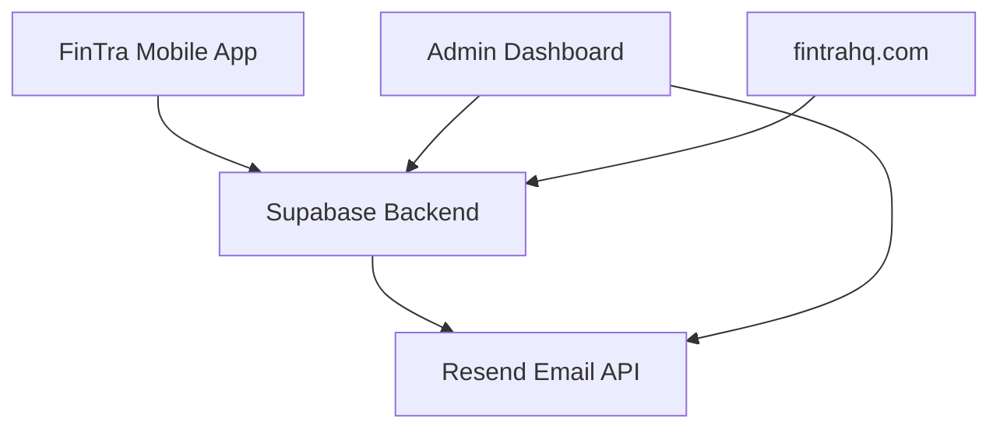

# FinTra - Project Overview

> FinTra ecosystem: mobile app, admin dashboard, landing page — all connected.

## 🏗 The Three Pillars

| Project | Tech | URL | Status |
|---------|------|-----|--------|
| [[FinTra - Product Overview\|Mobile App]] | Flutter + Dart | Play Store / App Store | Beta |
| [[FinTra - Admin Dashboard\|Admin Dashboard]] | Flutter Web | fintra-admin-deploy.vercel.app | Live |
| [[FinTra - Landing Page\|Landing Page]] | React + Tailwind | fintrahq.com | Live |

---

## 🧩 Shared Infrastructure

| Service | Purpose | Note |
|---------|---------|------|
| [[Supabase — FinTra Project]] | Database, Auth, Edge Functions | Project: `aesncvmhlgmdnmhwablm` |
| [[Resend — Email API]] | HTML email delivery | 100 emails/day free tier |
| [[Vercel — FinTra Admin]] | Admin dashboard hosting | Personal scope |
| [[Vercel — FinTra Landing]] | Landing page hosting | Team scope with custom domain |

---

## 📋 Related

- [[ADR-002 — Supabase Edge Functions for Backend Logic]]
- [[ADR-003 — Flutter Web for Admin Dashboard]]